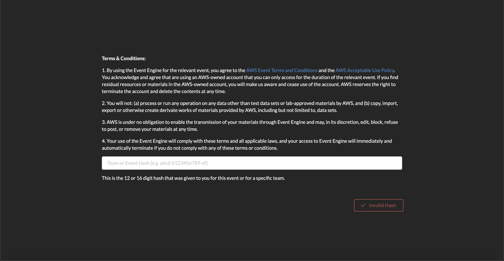
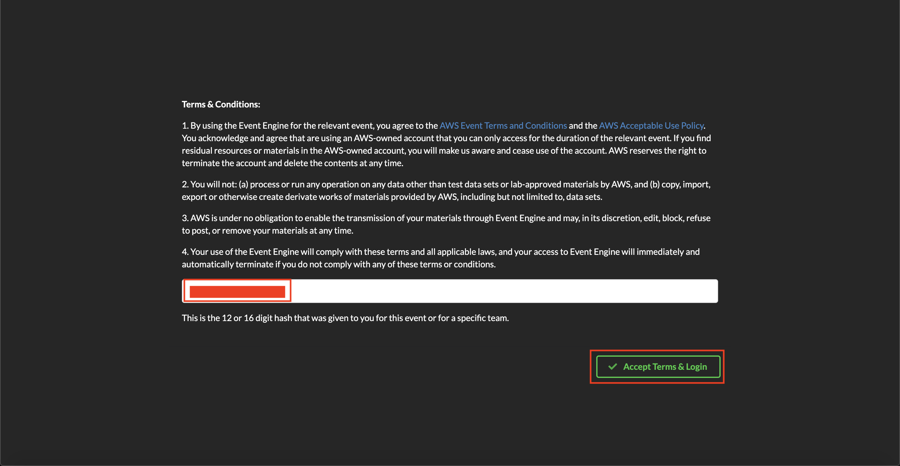
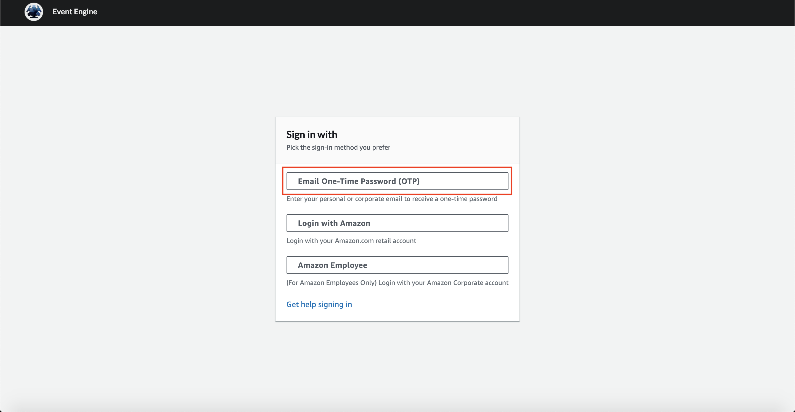
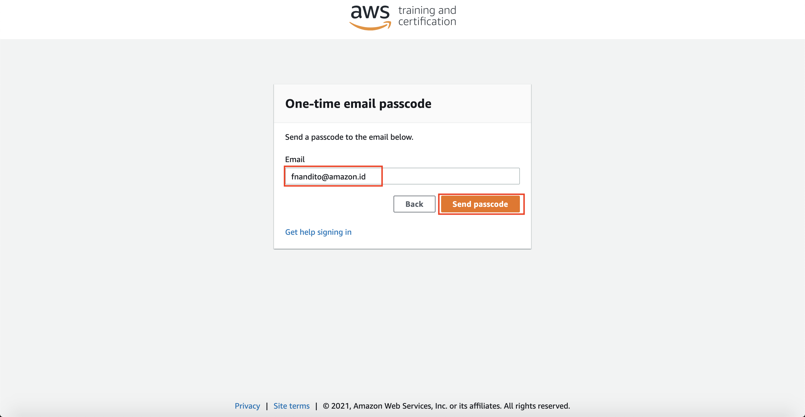
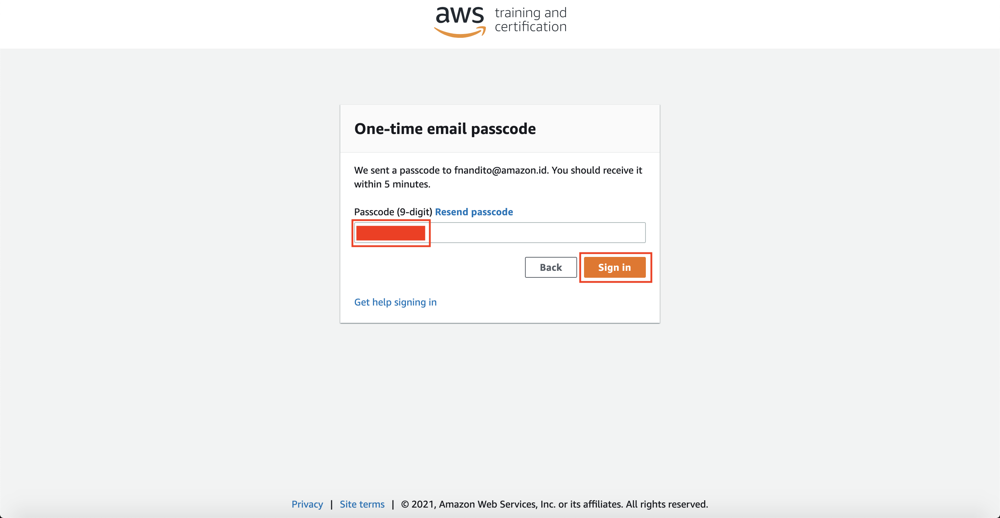
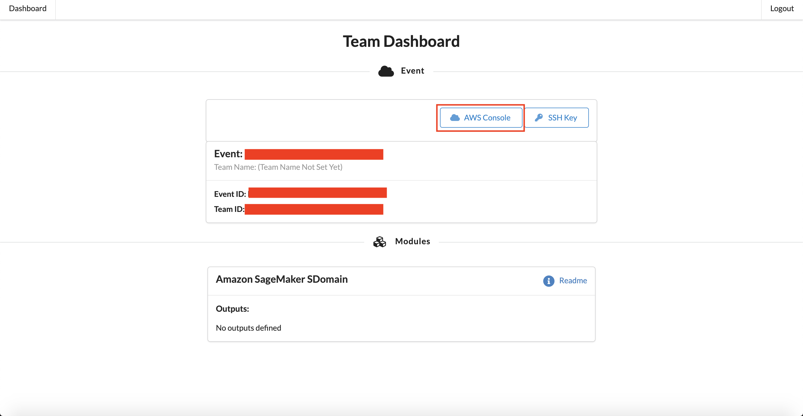
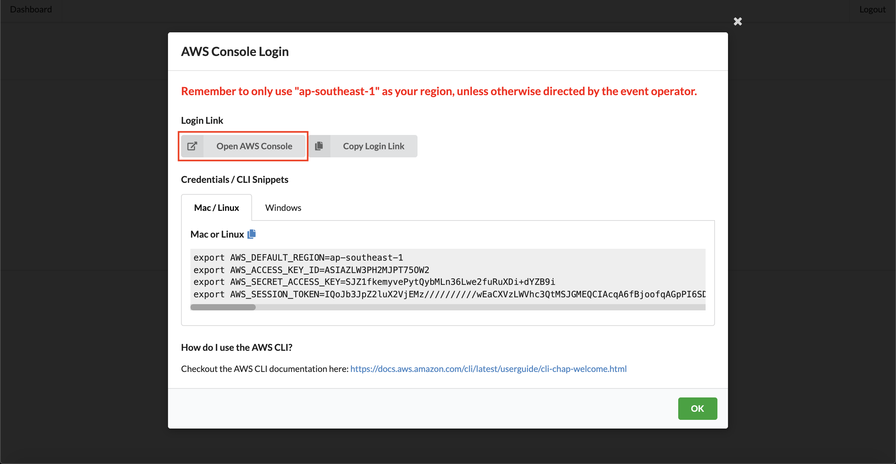
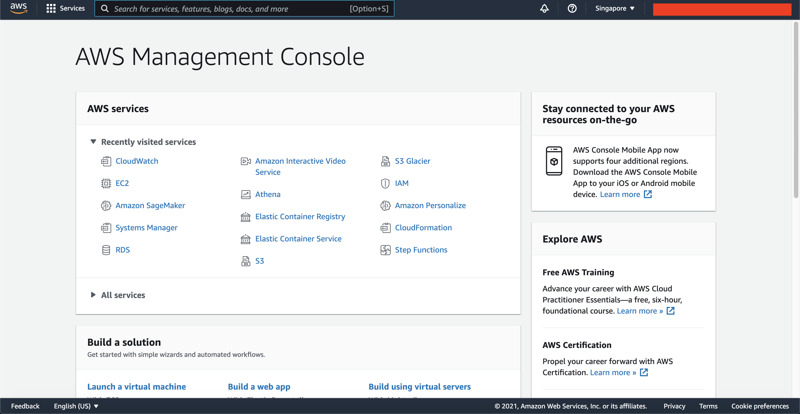

# Sicepat Hackathon x AWS - Petunjuk Login Temporary Account AWS

### Berikut adalah beberapa ketentuan dalam penggunakan akun sementara ini:
1. Region yang dapat digunakan hanyalah dalam region `ap-southeast-1` (Singapore)
2. 1 Akun hanya berlaku untuk 1 tim
3. Akun hanya berlaku selama **72 jam / 3 Hari** (Kami sarankan untuk menggunakan public git repository untuk menyimpan *source code* anda)

### Berikut merupakan petunjuk untuk login ke akun sandbox AWS
1. Klik [link ini](https://dashboard.eventengine.run/login) akan terbuka tampilan seperti berikut

2. dalam Halaman Event Engine, masukkan Kode Hash anda, dan klik `Accept Terms & Login`

3. Dalam tampilan `Sign in with`, pilih `Email One-Time Password (OTP)`

4. Masukkan email anda, dan klik `Send Passcode`

5. Kode OTP akan dikirimkan ke dalam email anda. Mohon cek email yang anda masukkan

6. Masukkan 9 digit code, dan klik `Sign In`

7. Setelah berhasil, akan muncul tampilan seperti berikut. Klik tombol `AWS Console`

8. Klik bagian `Open AWS Console`, AWS Console akan terbuka dalam tab baru

